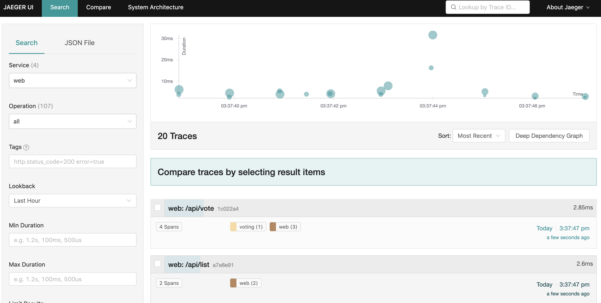

# emojivoto example

The Kubernetes cluster will run the emojivoto applications and a jaeger UI for visualizing the OpenTelemetry traces:


The different emojivoto applications are communicating via gRPC. Instrumenting those applications would allow us to view the gRPC requests between the applications.

## Deploying the emojivoto application

Run the following command:

```shell
kubectl -n test create -f https://raw.githubusercontent.com/Fish-pro/observer/examples/emojivoto/emoji
```

## Deploying the observer

Deploy the observer object for the application to be delivered

```shell
kubectl -n test create -f - <<EOF
apiVersion: ob.observer.io/v1alpha1
kind: Observer
metadata:
  labels:
    app.kubernetes.io/name: observer
    app.kubernetes.io/instance: observer-sample
    app.kubernetes.io/part-of: observer
    app.kubernetes.io/managed-by: kustomize
    app.kubernetes.io/created-by: observer
  name: observer-sample
spec:
  resourceSelectors:
    - apiVersion: apps/v1
      kind: Deployment
      name: emoji
    - apiVersion: apps/v1
      kind: Deployment
      name: voting
    - apiVersion: apps/v1
      kind: Deployment
      name: web
  launcher:
    imageRepository: keyval/launcher
    imageTag: v0.1
  agent:
    imageRepository: keyval/otel-go-agent
    imageTag: v0.6.0
  jaeger:
    name: jaeger
    serviceType: NodePort
    imageRepository: jaegertracing/opentelemetry-all-in-one
    imageTag: latest
    replicas: 1
    labels:
      app: observer
EOF
```

## Perform actions on the target Application

Now all that left to do is to perform some actions on the target application that will cause the creation of detailed distributed traces.

Port forward to the frontend service:

```shell
kubectl port-forward svc/web-svc 8080:80 -n emojivoto
```

Go to `http://localhost:8080`, and click the **view the leaderboard** button.

## Viewing the traces

First, port forward to the Jaeger UI:

```shell
kubectl port-forward svc/jaeger 16686:16686 -n emojivoto
```

Then, open the Jaeger UI in your browser by navigating to http://localhost:16686/

After selecting the `emojivoto-web` service, you should see the following traces:

